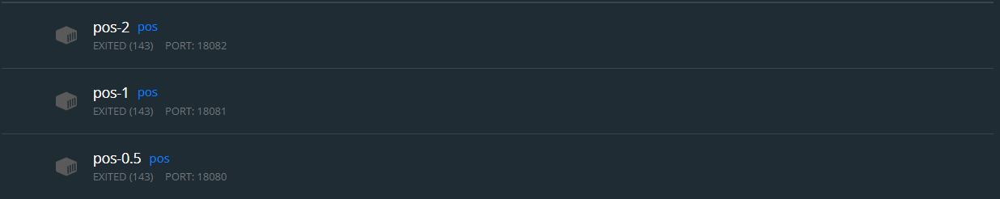

# WebPOS

The demo shows a web POS system , which replaces the in-memory product db in aw03 with a one backed by 京东.


To run

```shell
mvn clean spring-boot:run
```

Currently, it creates a new session for each user and the session data is stored in an in-memory h2 db. 
And it also fetches a product list from jd.com every time a session begins.

1. Build a docker image for this application and performance a load testing against it.
2. Make this system horizontally scalable by using haproxy and performance a load testing against it.
3. Take care of the **cache missing** problem (you may cache the products from jd.com) and **session sharing** problem (you may use a standalone mysql db or a redis cluster). Performance load testings.

Please **write a report** on the performance differences you notices among the above tasks.


------

### Docker镜像创建

在pom.xml中添加以下依赖：

```xml
<plugin>
    <groupId>com.google.cloud.tools</groupId>
    <artifactId>jib-maven-plugin</artifactId>
    <version>3.2.0</version>
    <configuration>
        <to>
            <image>app-webpos-cached</image>
        </to>
        <allowInsecureRegistries>true</allowInsecureRegistries>
    </configuration>
</plugin>
```

添加后执行compile构建Docker镜像。


### TASK1 垂直拓展

生成3份Docker镜像，其CPU占用分别为：0.5、1、2.



然后通过Gatling进行压力里测试，主要测试向购物车中添加一件产品。

测试脚本如下：

```scala
class Test extends Simulation {
  val httpProtocol = http
    .baseUrl("http://localhost:18080")
    .acceptHeader("text/html,application/xhtml+xml,application/xml;q=0.9,*/*;q=0.8")
    .doNotTrackHeader("1")
    .acceptLanguageHeader("en-US,en;q=0.5")
    .acceptEncodingHeader("gzip, deflate")
    .userAgentHeader(
      "Mozilla/5.0 (Macintosh; Intel Mac OS X 10.8; rv:16.0) Gecko/20100101 Firefox/16.0");

  val scn = scenario("Pos Test")
    .exec(http("request").get("/add?pid=13284888"))

  setUp(scn.inject(atOnceUsers(300)).protocols(httpProtocol))
}
```

执行Gatling脚本部分截图如下：


以下为三次测试的结果截图：


部分统计如下：

| CPU数量      | 0.5  | 1    | 2    |
| ------------ | ---- | ---- | ---- |
| 最小响应时间 | 292  | 264  | 229  |
| 最大响应时间 | 3970 | 2927 | 2384 |
| 平均响应时间 | 2223 | 1651 | 1335 |

通过上述对比可以得知，通过垂直拓展为设备提供硬件能力提升时，其功效能够同步得到线性增长。


### TASK2 水平拓展

首先生成四份CPU占用为0.5的Docker镜像，将其部署到四个端口运行：


接着在WSL中使用sudo apt install haproxy安装haproxy。

然后haproxy -f haproxy.cfg运行haproxy脚本：

```cfg
defaults
    mode tcp
frontend pos
    bind *:8080
    default_backend servers
backend servers
    balance roundrobin
    server server1 localhost:8081
    server server2 localhost:8082
    server server3 localhost:8083
    server server4 localhost:8084
```

最后分别通过Gatling对1，2，3，4个数量的容器进行压力测试，结果如下所示：


统计结果如下：

| 运行容器数       | 1    | 2    | 3    | 4    |
| ---------------- | ---- | ---- | ---- | ---- |
| 最小响应时间(ms) | 225  | 144  | 123  | 134  |
| 最大响应时间(ms) | 5570 | 3442 | 2815 | 2741 |
| 平均响应时间(ms) | 3120 | 1646 | 1493 | 1369 |

可以发现，随着水平拓展运行容器数的增加，操作响应时间在1至3时有明显减少，可以体现出水平拓展的增强效果。而3到4的效率增加不明显，可能是因为执行性能受多服务器的IO延迟限制。

另外在逐个增加容器的测试中发现，当增加容器后立即执行压力测试时，任务的完成数会卡在n/n+1的阶段一定时间。由此可以推断是新增容器尚未部署好，故需等待一段时间。


### TASK3 Redis缓存与会话

首先在pom.xml添加redis相关依赖：

```xml
<dependency>
    <groupId>org.springframework.boot</groupId>
    <artifactId>spring-boot-starter-cache</artifactId>
</dependency>
<dependency>
<groupId>org.springframework.session</groupId>
<artifactId>spring-session-data-redis</artifactId>
</dependency>
<dependency>
<groupId>org.springframework.boot</groupId>
<artifactId>spring-boot-starter-data-redis</artifactId>
</dependency>
```

然后配置application.properties：

```
spring.session.store-type=redis
spring.redis.cache.type=redis
spring.redis.cache.host=localhost
spring.redis.cache.port=6379
```

接着对Pos进行修改配置Cache，为Controller添加Session。

在application.properties中指定6个节点:

```
127.0.0.1:7000,127.0.0.1:7001,127.0.0.1:7002,127.0.0.1:7003,127.0.0.1:7004,127.0.0.1:7005
```

Redis节点配置信息如下：

```
port 7000
cluster-enabled yes
cluster-config-file nodes.conf
cluster-node-timeout 5000
appendonly yes
```

按照曹老师给的脚本运行：

```
for d in ./*/ ; do { cd "$d" && redis-server ./redis.conf &}; done

redis-cli --cluster create 127.0.0.1:7000 127.0.0.1:7001 \
127.0.0.1:7002 127.0.0.1:7003 127.0.0.1:7004 127.0.0.1:7005 \
--cluster-replicas 1 &
```

在WSL运行脚本即可构建集群。

测试结果如下所示：


可见采用redis缓存与集群的方式，性能又得到了提升。
